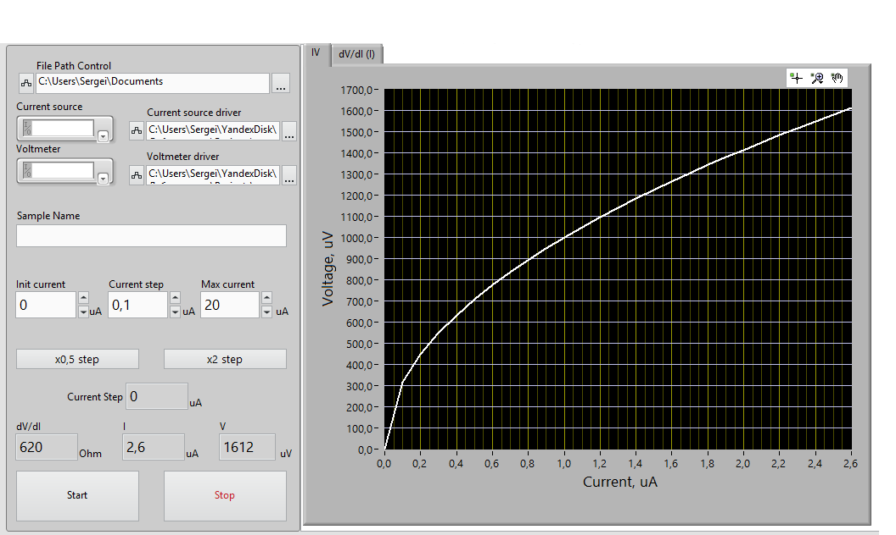
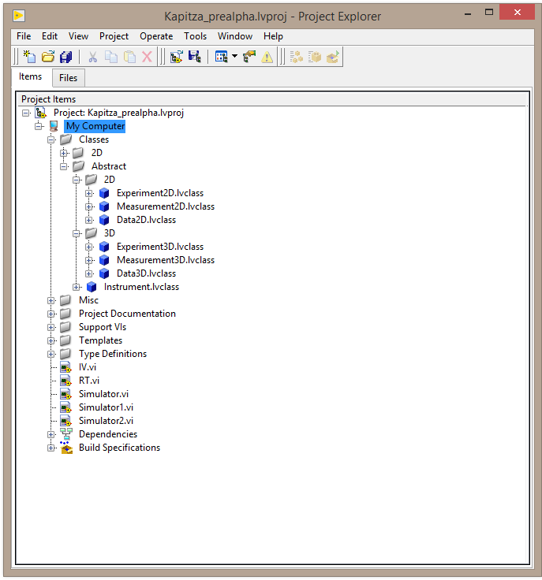

# Kapitza
Universal solution for scientific research

The main principle is divide hardware from software and unified all measuremets in general view as plotting n-dimension graph.

All hardware encapsulated in Instrument class via drivers: VIs that define communication between main program and hardware.

Template classes are written as abstract classes for every dimension. Every dimension has three classes: Experiment, Measurement, Data. Experiment is the general "box" with all high-level functions that are using in the application. Measurement class deals with measurement procedure, keeps all parameters of measurement and all measurement's logic. Data has all data itself and save it in convinient way with all additional formatting and calculations.

